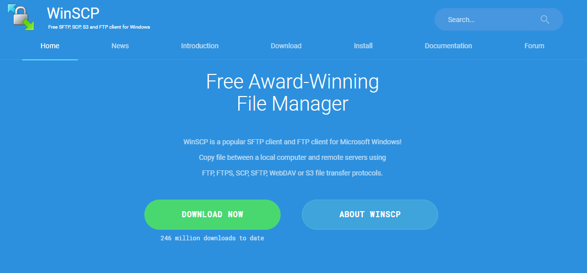

# File Sharing with WinSCP

This guide explains how to transfer files securely between your Windows host and CentOS/Debian virtual machines using **WinSCP** over SFTP (SSH File Transfer Protocol).

---

## Step 1: Install WinSCP

Download WinSCP from the official website:  
👉 https://winscp.net  

Run the installer with default options.



---

## Step 2: Make Sure SSH is Running on the VM

Before connecting, confirm that the **SSH server** is installed and active.

### On Debian
```bash
systemctl status ssh
```
### On CentOS
```bash
systemctl status sshd
```
## Step 3: get ip adress
```bash
ip a
```
## Step 4: Connect with WinSCP

Open WinSCP.

Click New Session and enter:

File protocol: SFTP

Host name: VM IP (e.g., 192.168.56.101)

Port number: 22

User name: your Linux username

Password: your Linux password

Click Save, then Login.
