# Installing CentOS and Debian on VirtualBox

## Step 1: Download ISOs and virtual box
- Virtal box download: https://www.virtualbox.org/wiki/Downloads
  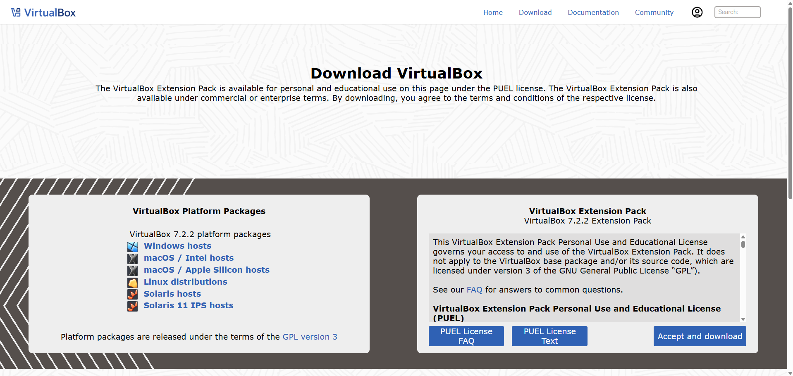
- CentOS Stream: https://www.centos.org/download/
  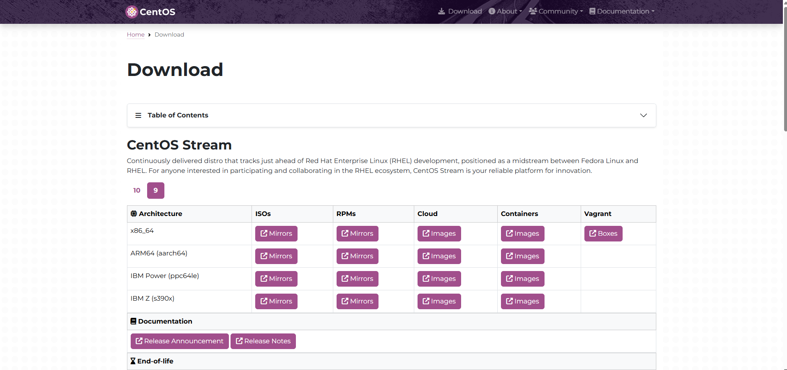
- Debian: https://www.debian.org/distrib/
  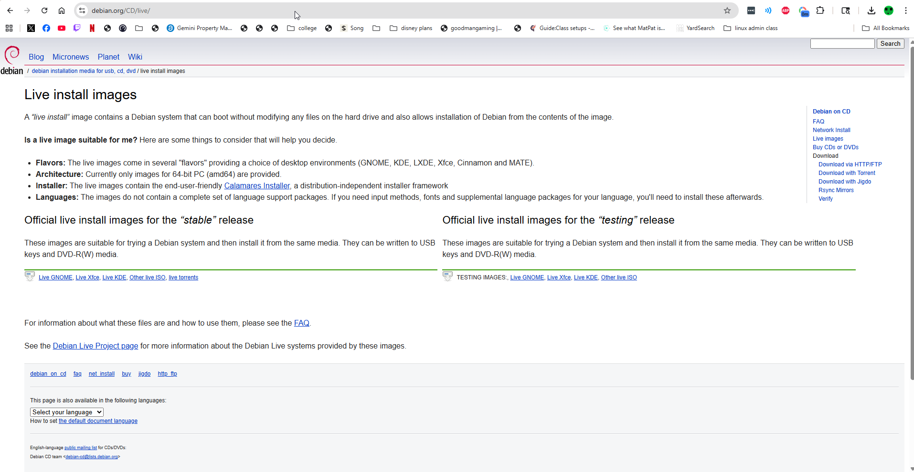

---

## Step 2: Create Virtual Machines
- Open VirtualBox → *New*
- Example settings:
  - **Type:** Linux
  - **Version:** Red Hat (64-bit) for CentOS, Debian (64-bit) for Debian
  - **Memory:** 8 GB
  - **Disk:** 20 GB
    
CentOS install:

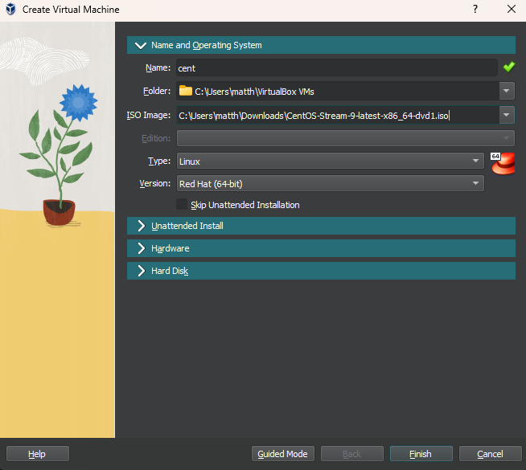

Debian install:

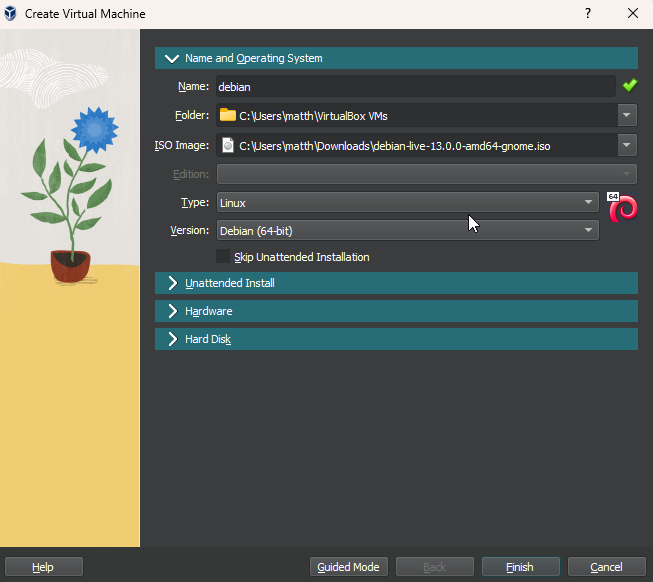

Base memory and processors:

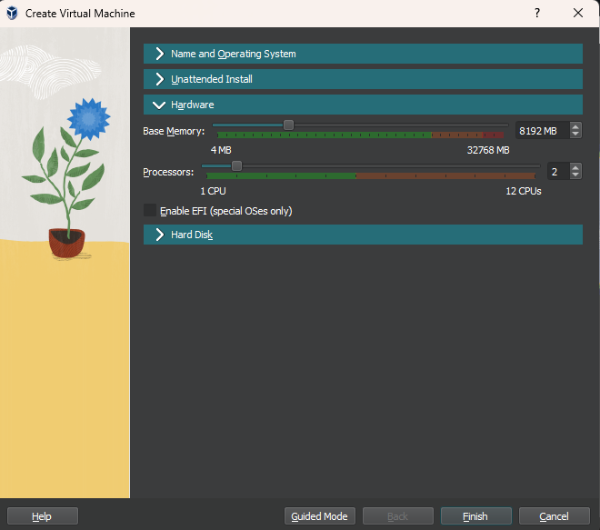

---

## Step 3: Install the OS
- Attach ISO in **Settings → Storage**
- Follow installer prompts:
  - Select language
  - Accept default disk settings
  - Create root + user accounts

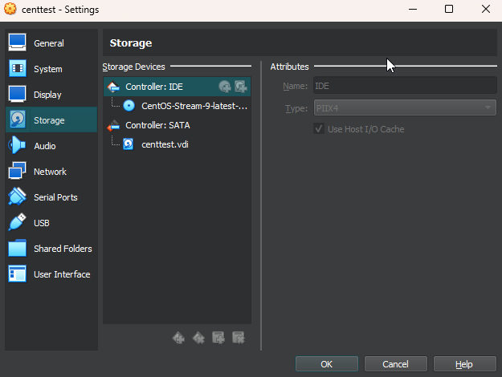

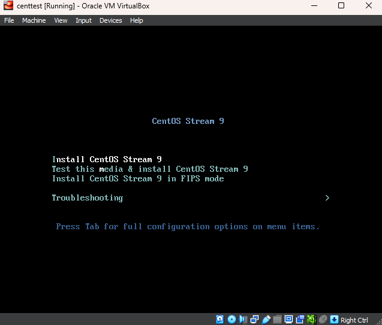

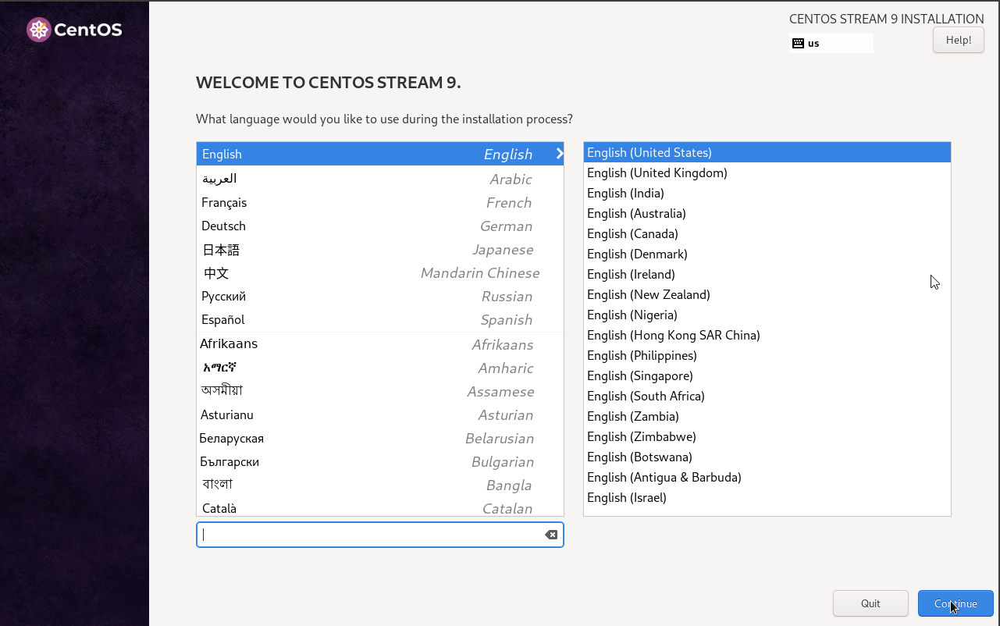

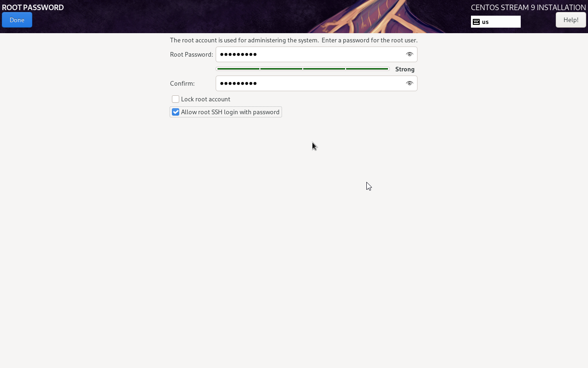

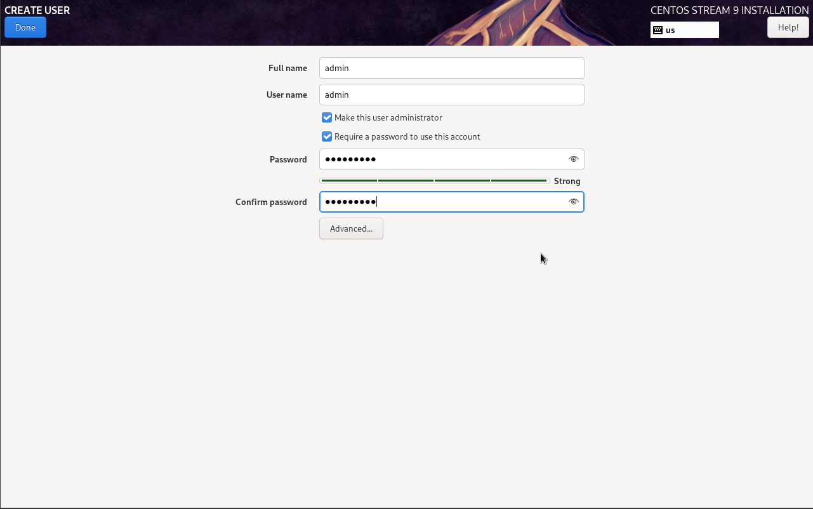

---

## Step 4: First Boot
- Eject ISO, reboot
- Log in with user credentials

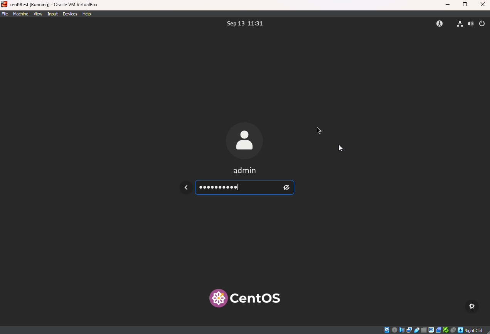

---

✅ You now have CentOS and Debian VMs installed in VirtualBox.
