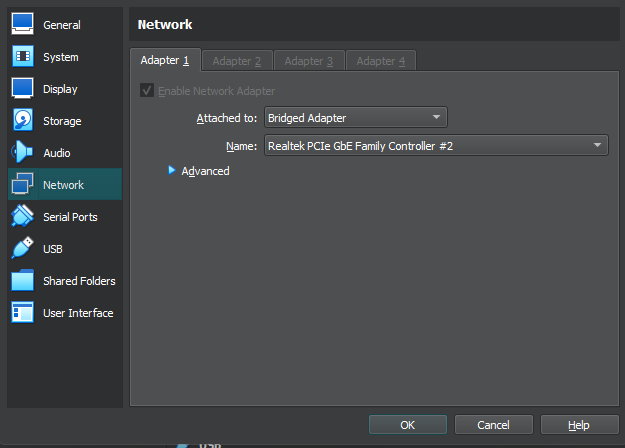
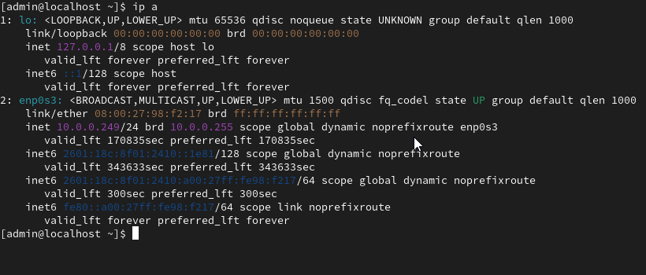

# Software & Configurations

## Step 1: Update Packages
- Debian:
 ```bash
  sudo apt update && sudo apt upgrade -y
 ```
- CentOS
``` bash
sudo yum update -y
```

## Step 2: install SSH Server
- Debian
 ```
  sudo apt install openssh-server -y
  sudo systemctl enable ssh --now
  ```
- CentOS
 ```
  sudo yum install openssh-server -y
  sudo systemctl enable sshd --now
  ```

## Step 3: Configure Networking
- open network setting in virtual box
    - change adaptor 1 to bridged adaptor
      
  
- Get IP adress
  - in terminal run: ip a
  
