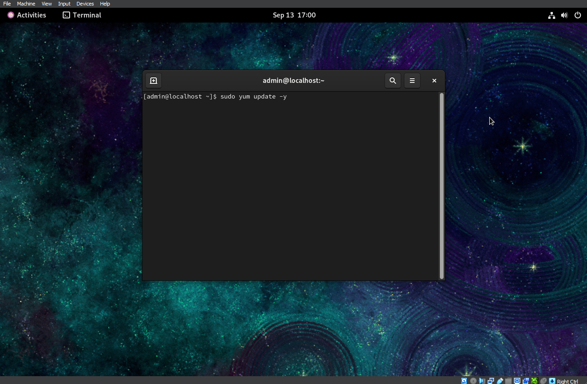
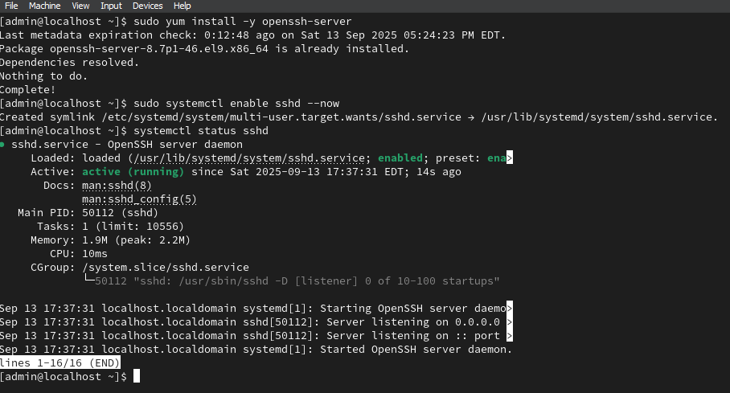

# Software & Configurations

## Step 1: Update Packages
- Debian:
 
  sudo apt update && sudo apt upgrade -y
  
- CentOS
sudo yum update -y
  

## Step 2: install SSH Server
- Debian
  sudo apt install openssh-server -y
  sudo systemctl enable ssh --now
  
- CentOS
  sudo yum install openssh-server -y
  sudo systemctl enable sshd --now
  

## Step 3: Configure Networking
- open network setting in virtual box
    - change adaptor 1 to bridged adaptor
  
- Get IP adress
  - in terminal run: ip a
  
